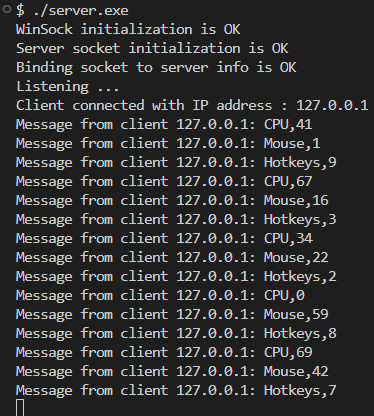
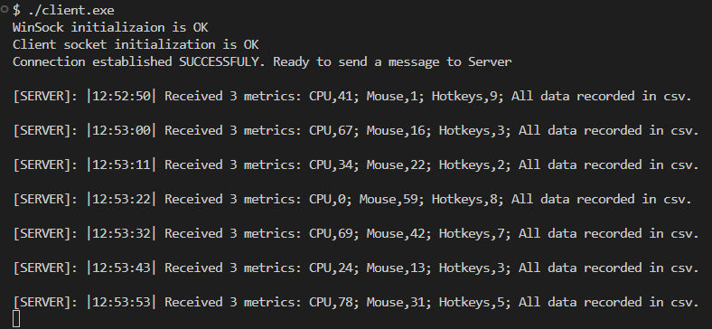
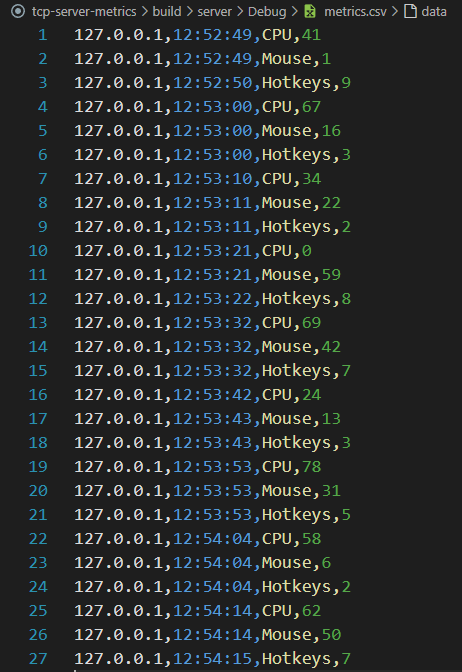

# tcp-server-metrics

## **Как запустить**

### **Требования**
- Windows OS.
- Установленный CMake
- Компилятор C++ (MSVC)

### **Инструкция по запуску**

1. **Сборка проекта**
    ```bash
     git clone https://github.com/ilya-kan07/tcp-server-metrics.git
     ```

    ```bash
     cd tcp-server-metrics
     ```

     ```bash
     mkdir build && cd build
     ```

     ```bash
     cmake ..
     ```

     ```bash
     cmake --build .
     ```

2. **Запуск серверной части**

     ```bash
     cd server/Debug
     ```

     ```bash
     server.exe
     ```

3. **Запуск клиентской части**

     ```bash
     cd client/Debug
     ```

     ```bash
     client.exe
     ```

---

## **Примеры работы**

### **1. Сервер**


### **2. Клиент**


### **3. CSV файл**

